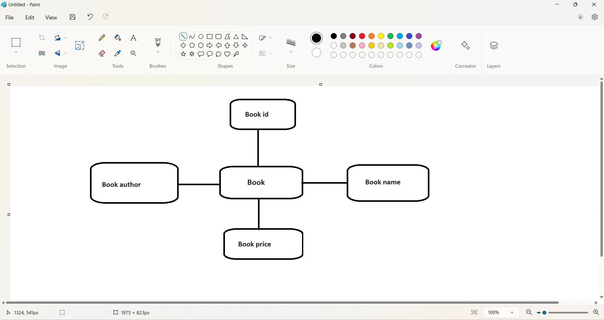
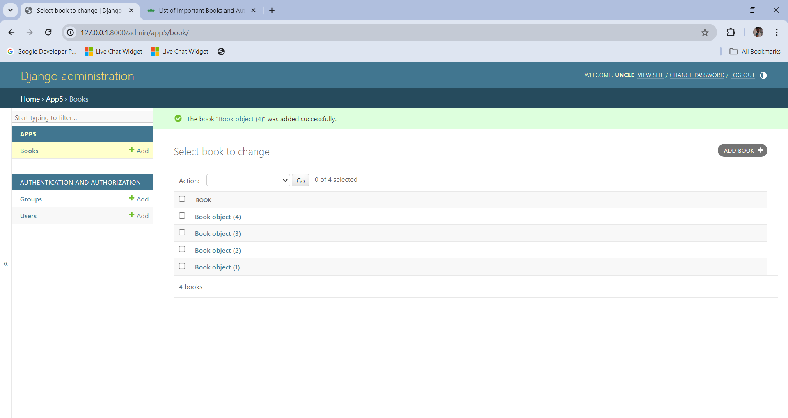

# Ex02 Django ORM Web Application
## Date: 
04/04/24
## AIM
To develop a Django application to store and retrieve data from a Book database using Object Relational Mapping(ORM).

## Entity Relationship Diagram


## DESIGN STEPS

### STEP 1:
Clone the problem from GitHub

### STEP 2:
Create a new app in Django project

### STEP 3:
Enter the code for admin.py and models.py

### STEP 4:
Execute Django admin and create details for 10 books

## PROGRAM

```
admin.py

from django.contrib import admin
from .models import Book
admin.site.register(Book)

models.py

from django.db import models

class Book(models.Model):
    Bookid=models.IntegerField()
    Bookname=models.CharField(max_length=20)
    Bookauthor=models.CharField(max_length=50)
    Bookprice=models.IntegerField()
```

## OUTPUT


## RESULT
Thus the program for creating a database using ORM hass been executed successfully
